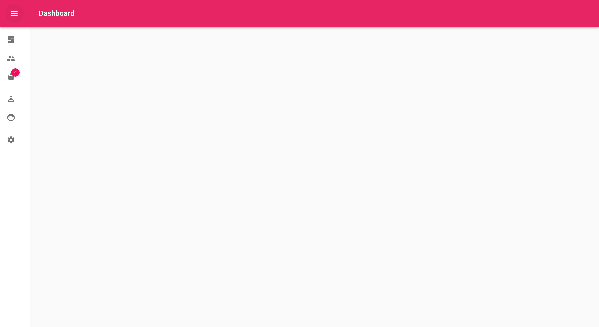
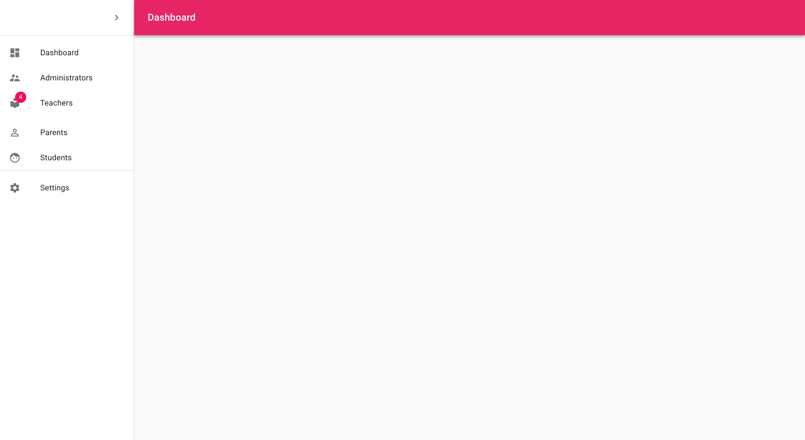

This project was just created in a bareform for those working with react

# Admin Template

The template was created using

- [React Js](https://reactjs.org/) with [Create React App](https://github.com/facebook/create-react-app)
- [Material UI React](https://material-ui.com/)
- [Semantic UI React](https://react.semantic-ui.com/)

This is the look of this admin template

When clicked on Menu Icon

> # **Steps to follow to Clone project**

> - Navigator into the directory of your choice
> - git clone https://github.com/Boanerges1996/adminTemplate.git
> - You can now open in any editor of your choice and edit to suit your preference
> - Incase you use vscode
>   - cd adminTemplate && code .
